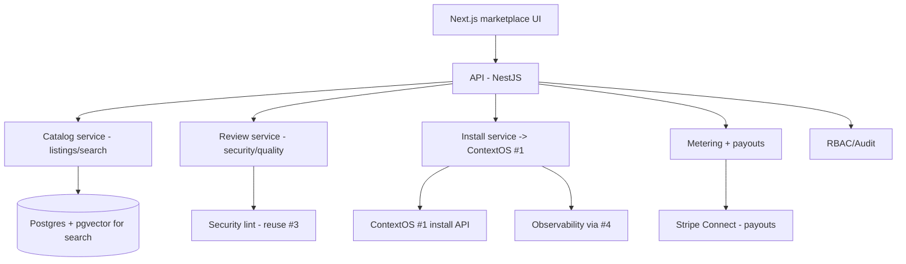

# Agent Marketplace — ARCHITECTURE

## Components
| Component | Job | Tech |
|-----------|-----|------|
| Catalog | Listings, categories, semantic + keyword search | NestJS + Postgres + pgvector |
| Review | Security/quality review pipeline (manual + automated) | NestJS + reuse #3 security lint |
| Install | One-click install into ContextOS (#1) | client to #1 install API |
| Metering + payouts | Usage metering + revenue share | Stripe Connect |
| Governance | RBAC, audit, takedowns, private registries | NestJS + Postgres |

## Boundaries
The marketplace is an **assembly layer**: supply from #3, install target #1, runtime observability #4, security lint #3. It owns catalog + review + economy; it reuses the rest.

## Data flow (publish→install→earn)
Creator submits → review (security lint + manual) → listed → consumer searches → one-click install into #1 → runs (observed via #4) → metered → revenue share via Stripe Connect.

## Multi-tenancy
`org_id`+RLS; public marketplace + private org marketplaces (V2); listings scoped to visibility.

## Scale
Catalog/search is light; the platform pieces it depends on (#1/#4) carry runtime load. Managed PaaS; K8s only if needed (D-009).

## NFRs
Search p95 < 1s; install reliable + reversible; payouts accurate + auditable; only reviewed listings installable.
