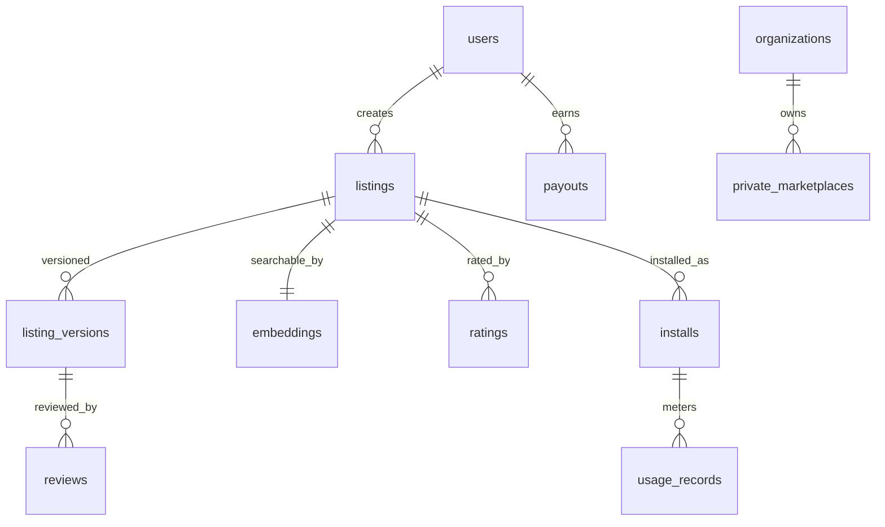

# Agent Marketplace — DATABASE

PostgreSQL + pgvector (search). `org_id`+RLS (D-004); plus public/private listing visibility.

## Entities
`users` (creator + consumer roles), `organizations`, `listings` (type: agent|mcp_server|workflow; title, description, category, visibility, status), `listing_versions` (version, changelog, artifact ref, review_status), `embeddings` (listing search vectors), `reviews` (security/quality review results), `ratings` (consumer ratings/reviews), `installs` (listing↔org install records), `usage_records` (per-run metering), `payouts` (creator earnings, Stripe Connect refs), `transactions`, `audit_logs`, `private_marketplaces` (org-scoped, V2), `api_keys`.

## ERD

## Key notes
- `listings` carry `visibility` (public | org-private) and `status` (draft|in_review|approved|rejected|removed); only `approved` are installable.
- `listing_versions.review_status` gates publishing (security review).
- `installs` link to ContextOS (#1) install records; `usage_records` feed metering → `payouts` (Stripe Connect revenue share).
- pgvector on `embeddings` for semantic discovery; FTS for keyword.
- `org_id` + RLS; private marketplaces scoped per org (V2).
- Standard backups; `audit_logs` immutable (takedowns, payouts).
