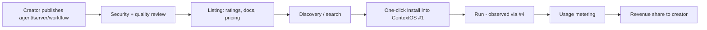

# Agent Marketplace

[](./LICENSE)
[](#-free--open-source)
[](https://github.com/sponsors/MNikks01)

> 💚 **Free & open source, forever.** Every feature is available to everyone — no paywalls, no tiers, no sign-up. Clone and self-host it, or use the hosted app. Licensed under Apache-2.0. If it helps you, [sponsoring](https://github.com/sponsors/MNikks01) is welcome but always optional.

**▶ Try it / deploy your own:** [](https://vercel.com/new/clone?repository-url=https%3A%2F%2Fgithub.com%2FMNikks01%2Fagent-marketplace&root-directory=web&project-name=agent-marketplace) · see [DEPLOY.md](./DEPLOY.md) for CLI & self-hosting.

**🖥️ CLI:** search, install, and publish listings (security-reviewed; seeds a demo catalog):
```bash
node engine/src/cli.ts list
node engine/src/cli.ts search "payments stripe"
node engine/src/cli.ts install stripe-mcp     # prints the mcp.json fragment
node engine/src/cli.ts publish listing.json
```


> **A curated, open marketplace for AI agents, MCP servers, and workflows.** Creators publish; teams discover, install, and run them — security-reviewed. The marketplace software itself is free & open source; any creator revenue-share is a listing-level concept that creators opt into, never a fee to use this platform. The ecosystem layer that sits on top of the platform.

**Project #7** · Priority ⭐⭐ (platform) · Difficulty: High (network effects) · Time-to-MVP: 3–4 months · **Build LAST (Year 3).**

## About this repository

This is **Agent Marketplace (#7)**, extracted from a larger "AI Startup Lab." The root docs are the product spec/vision; references to sibling projects point to that broader context and aren't part of this standalone repo. Related repos: [`contextos`](https://github.com/MNikks01/contextos) (#1), [`codebase-intelligence`](https://github.com/MNikks01/codebase-intelligence) (#2), [`mcp-server-generator`](https://github.com/MNikks01/mcp-server-generator) (#3), [`agent-monitoring-platform`](https://github.com/MNikks01/agent-monitoring-platform) (#4), [`project-bootstrapper`](https://github.com/MNikks01/project-bootstrapper) (#5).

**The working engine is in [`engine/`](./engine)** — publish security-reviewed listings (agents / MCP servers / workflows), discover/search, one-click install (returns an `mcp.json` fragment), rate, meter usage, and compute creator revenue share. Pure TypeScript, zero-network. Try it:
```bash
cd engine && node scripts/demo.ts && node scripts/test.ts
```

Licensed under **Apache-2.0** — see [LICENSE](./LICENSE).

## What
A two-sided marketplace: creators publish agents, MCP servers (from #3), and workflows; consumers discover, install (one-click into ContextOS #1), and run them. Curation + security review + ratings build trust; usage-based revenue share aligns incentives. It turns the lab's platform into an ecosystem.

## Why
Marketplaces are powerful moats (network effects) but suffer cold-start: they need distribution + trust first. That's exactly why this is built **last** — after ContextOS (#1) provides the distribution (users who install into real workflows), #3 provides supply (generated servers), and #4 provides trust (observability). Done too early, it's a ghost town.

## Who
Two sides: **creators** (devs/agencies building agents/servers/workflows wanting reach + revenue) and **consumers** (teams wanting pre-built, trusted capabilities). See [CUSTOMERS.md](./CUSTOMERS.md).

## How


## Capability ladder
- **MVP:** Listings (MCP servers from #3 + agents), discovery/search, one-click install into #1, ratings.
- **V1:** Security review, creator payouts (revenue share), usage metering, versioning.
- **V2:** Workflows, private/org marketplaces, certification, analytics for creators.
- **V3:** Full ecosystem governance, enterprise private registries, partner program.

## Doc map
[VISION](./VISION.md) · [PROBLEM](./PROBLEM.md) · [CUSTOMERS](./CUSTOMERS.md) · [FEATURES](./FEATURES.md) · [USER_STORIES](./USER_STORIES.md) · [ARCHITECTURE](./ARCHITECTURE.md) · [TECH_STACK](./TECH_STACK.md) · [DATABASE](./DATABASE.md) · [API_DESIGN](./API_DESIGN.md) · [AI_ARCHITECTURE](./AI_ARCHITECTURE.md) · [RAG](./RAG.md) · [MCP](./MCP.md) · [AGENT_DESIGN](./AGENT_DESIGN.md) · [SECURITY](./SECURITY.md) · [OBSERVABILITY](./OBSERVABILITY.md) · [GUARDRAILS](./GUARDRAILS.md) · [DEVOPS](./DEVOPS.md) · [TASKS](./TASKS.md) · [SPRINTS](./SPRINTS.md) · [PRICING](./PRICING.md) · [GTM](./GTM.md) · [SALES](./SALES.md) · [RISKS](./RISKS.md) · [HIRING](./HIRING.md) · [OPEN_SOURCE](./OPEN_SOURCE.md) · [RESUME_VALUE](./RESUME_VALUE.md) · [CLAUDE.md](./CLAUDE.md) · [AGENTS.md](./AGENTS.md) · [llms.txt](./llms.txt) · [mcp.json](./mcp.json)

*Build LAST (Year 3) — needs the platform's distribution + trust first. The ecosystem moat. See ROADMAP.md.*
